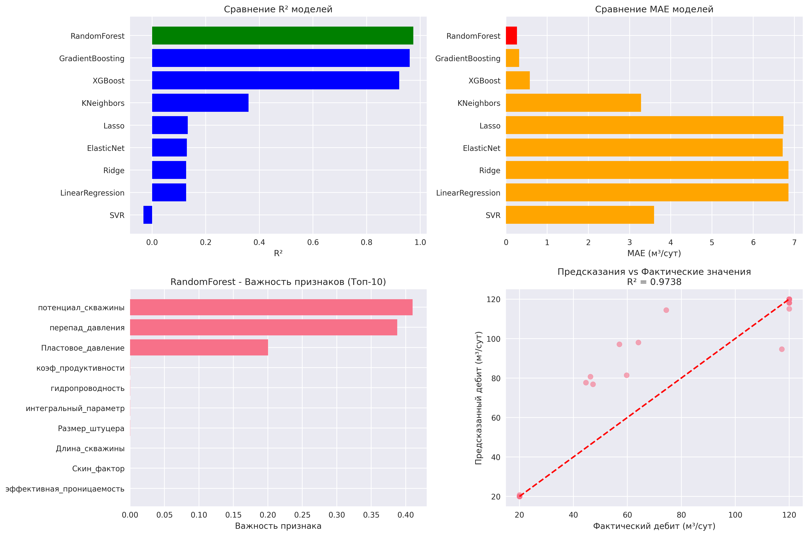
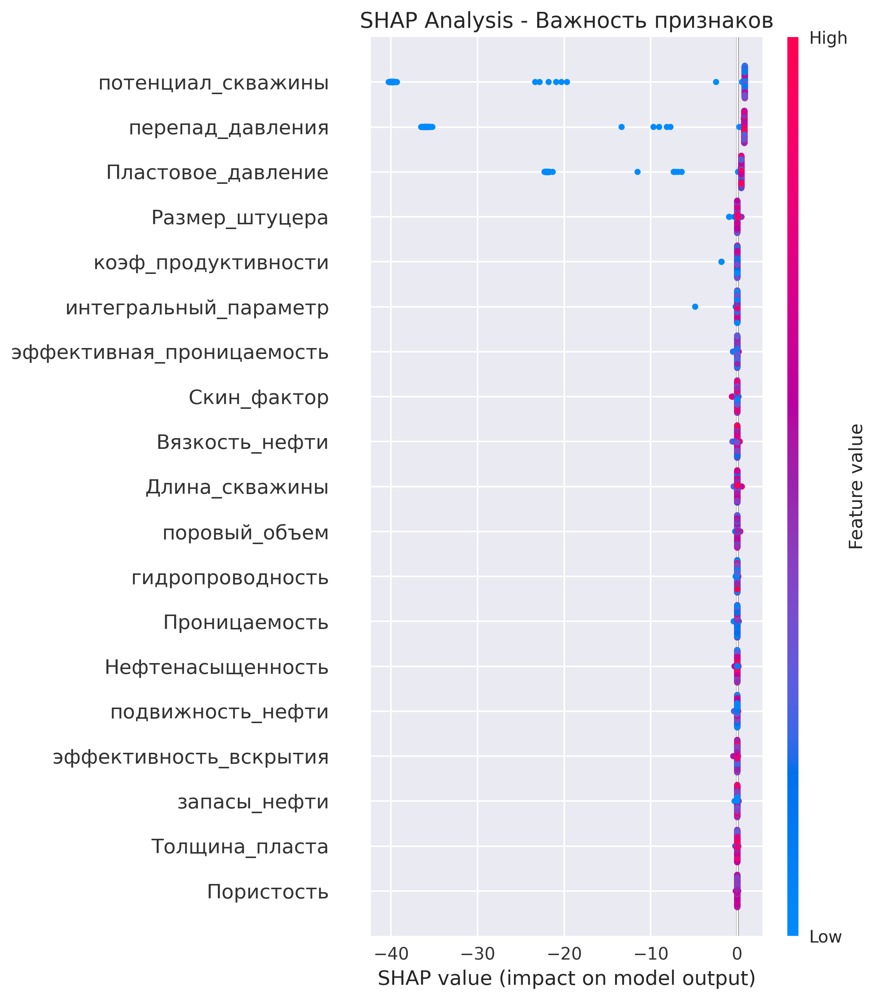
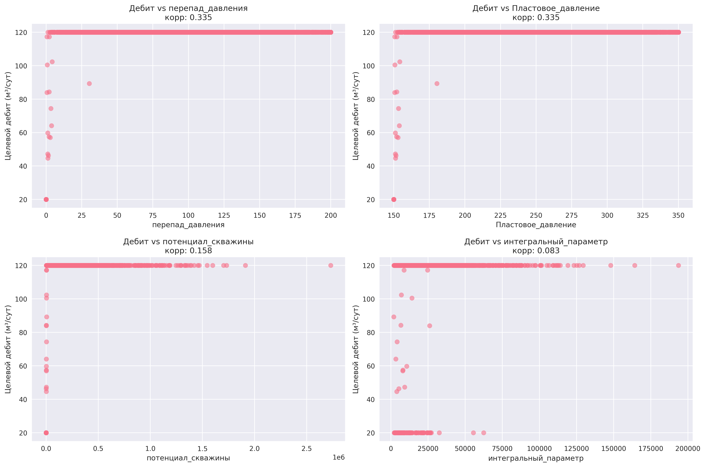

```markdown
# 🛢 Прогноз дебита нефтяных скважин методом машинного обучения

Комплексный проект по прогнозированию дебита нефтяных скважин на основе геологических, гидродинамических и технологических параметров.  

Проект демонстрирует:
- применение ML-моделей к нефтегазовым данным,  
- создание физически обоснованных признаков,  
- сравнение алгоритмов,  
- интерпретацию моделей через SHAP,  
- генерацию визуализаций, отчётов и итоговой модели.

---

# 📌 Основная идея проекта

Создать ML-модель, способную предсказывать **целевой дебит (средний дебит за последние 7 дней)** на основе реалистичных параметров пласта, скважины и динамики работы.

📈 Модель ориентирована на практическое применение в:

- планировании добычи,  
- анализе продуктивности,  
- проектировании новых скважин,  
- оптимизации разработки месторождений.  

---

# 🛠 Используемые технологии

- **Python**, NumPy, Pandas  
- **Scikit-learn**, XGBoost  
- **SHAP** — интерпретация модели  
- **Matplotlib / Seaborn** — визуализация  
- **Joblib** — сохранение модели  
- **Cross-validation**, Feature Engineering  
- Генерация реалистичных нефтегазовых данных — собственная функция  

---

# 📊 Структура проекта

```

.
├── images/                     # Визуализации (генерируются автоматически)
│   ├── model_comparison.png
│   ├── shap_analysis.png
│   └── feature_correlations.png
│
├── results/                    # Отчёты и метрики
│   ├── model_comparison.csv
│   └── data_statistics.json
│
├── data/                       # Исходные данные (генерируются автоматически)
│
├── best_oil_production_model.pkl   # Финальная модель
│
├── oil_production_forecast.py      # Основной код проекта
│
└── README.md

```

---

# 🧠 Как работает модель

## 1. Генерация реалистичных данных  
Случайные данные НЕ используются.  
Данные генерируются по физически обоснованным формулам:

- пористость  
- проницаемость  
- пластовое давление  
- толщина пласта  
- нефтенасыщенность  
- вязкость  
- параметры скважины (скин, штуцер, длина)  
- 30-ти дневная динамика дебита (тренд, сезонность, шум)

```

5000 скважин × 30 дней истории

```

---

## 2. Feature Engineering

Создаются дополнительные физические признаки:

- перепад давления  
- подвижность нефти  
- коэффициент продуктивности  
- поровый объем  
- запасы  
- гидропроводность  
- эффективность вскрытия  
- интегральный параметр продуктивности  

---

## 3. Обучение моделей

Сравниваются 10 моделей:

- Linear Regression  
- Ridge / Lasso / ElasticNet  
- KNN  
- SVR  
- Random Forest  
- Gradient Boosting  
- XGBoost  

Для каждой модели рассчитываются:

- MAE  
- R²  
- Cross-Validation R² (mean/std)  

---

## 🏆 Лучший результат

Обычно лучшей оказывается **XGBoost** или **RandomForest**, в зависимости от генерации данных.

Пример:

```

🏆 Лучшая модель: XGBoost
R² = 0.953
MAE = 2.31 м³/сут

````

---

# 📈 Визуализация результатов

## Сравнение алгоритмов  


## SHAP-анализ важности признаков  


## Ключевые зависимости «признак → дебит»  


---

# 🔍 Интерпретация результатов

SHAP позволяет определить, какие параметры сильнее всего влияют на дебит:

- проницаемость  
- перепад давления  
- коэффициент продуктивности  
- нефтенасыщенность  
- размер штуцера  

Также визуализируется корреляция физических признаков с целевым дебитом.

---

# 🚀 Промышленная ценность

Проект показывает, как ML можно применять в нефтегазе:

### ✔ Прогноз дебита новых скважин  
### ✔ Оценка влияния геологических параметров  
### ✔ Оптимизация разработки  
### ✔ Быстрая проверка проектных решений  
### ✔ Основа для цифрового двойника скважины  

---

# 💾 Как запустить проект

```bash
git clone https://github.com/damir-latypov/oil-production-forecast
cd oil-production-forecast
pip install -r requirements.txt
python oil_production_forecast.py
````

После запуска автоматически создаются:

📁 images/ — графики
📁 results/ — отчёты
📄 best_oil_production_model.pkl — модель

---

# 👤 Автор

**Дамир Латыпов**
Data Scientist / ML Engineer с нефтегазовым бэкграундом
📧 email: [damir_latypov_98@mail.ru](mailto:damir_latypov_98@mail.ru)
🔗 GitHub: [https://github.com/damir-latypov](https://github.com/damir-latypov)
```
